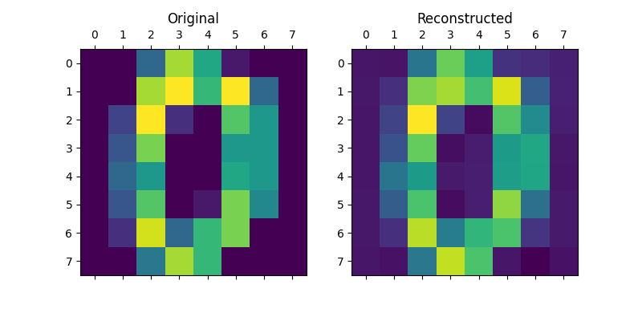
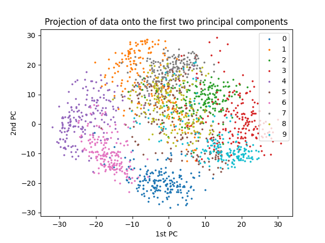
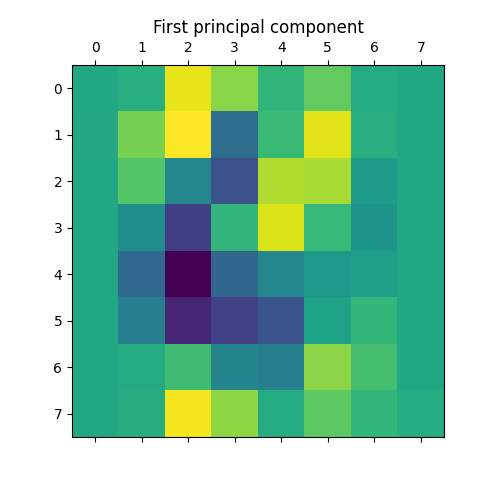
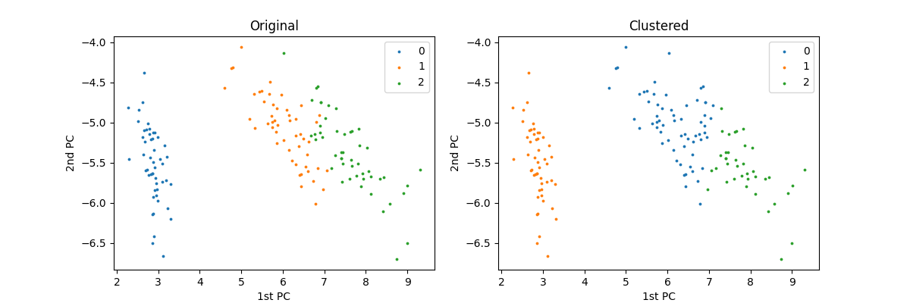

Examples
=============

This section provides some examples of how RithML can be used to perform machine learning tasks. The examples involve data and metrics
from `scikit-learn`_.

.. _scikit-learn: https://scikit-learn.org/

Classification
--------------

In this example, we fit a logistic regression model (:py:mod:`rithml.classification.LogisticRegression`) to the iris dataset.

The dataset consists of 150 samples, 4 features, and 3 classes.

.. doctest::

    >>> from rithml.classification import LogisticRegression
    >>> from sklearn.datasets import load_iris
    >>> from sklearn.model_selection import train_test_split
    >>> X, y = load_iris(return_X_y=True)
    >>> X_train, X_test, y_train, y_test = train_test_split(X, y, random_state=99, stratify=y)
    >>> clf = LogisticRegression()
    >>> clf.fit(X_train, y_train)
    <rithml.classification.LogisticRegression object at 0x00000117D587CCD0>
    >>> y_pred = clf.predict(X_test)

To evaluate the model's performance, we look at the accuracy of its predictions.

.. doctest::

    >>> print('Accuracy: {}'.format((y_test == y_pred).sum() / len(y_test)))
    Accuracy: 0.9736842105263158

For a more comprehensive analysis, we can use the ``sklearn.metrics`` module to generate a `classification report`_ or a `confusion matrix`_.

.. doctest::

    >>> from sklearn.metrics import classification_report, confusion_matrix
    >>> print(classification_report(y_test, y_pred))
                  precision    recall  f1-score   support

               0       1.00      1.00      1.00        12
               1       1.00      0.92      0.96        13
               2       0.93      1.00      0.96        13

        accuracy                           0.97        38
       macro avg       0.98      0.97      0.97        38
    weighted avg       0.98      0.97      0.97        38
    >>> print(confusion_matrix(y_test, y_pred))
    [[12  0  0]
     [ 0 12  1]
     [ 0  0 13]]

The same analysis may be applied to other classes in :py:mod:`rithml.classification`, since they all have ``fit`` and ``predict`` methods.

.. _classification report: https://scikit-learn.org/stable/modules/generated/sklearn.metrics.classification_report.html
.. _confusion matrix: https://scikit-learn.org/stable/modules/generated/sklearn.metrics.confusion_matrix.html

.. _Regression:

Regression
----------

In this example, we fit a linear regression model (:py:mod:`rithml.regression.LinearRegression`) to the diabetes dataset.

The dataset consists of 442 samples and 10 features.

.. doctest::

    >>> from rithml.regression import LinearRegression
    >>> from sklearn.datasets import load_diabetes
    >>> from sklearn.model_selection import train_test_split
    >>> X, y = load_diabetes(return_X_y=True)
    >>> X_train, X_test, y_train, y_test = train_test_split(X, y, random_state=99)
    >>> reg = LinearRegression()
    >>> reg.fit(X_train, y_train)
    <rithml.regression.LinearRegression object at 0x00000117D582E370>
    >>> y_pred = reg.predict(X_test)

To evaluate the model's performance, we can use the ``sklearn.metrics`` module to compute the `mean squared error (MSE)`_ or the `R-squared coefficient`_ of the model's predictions.

.. doctest::

    >>> from sklearn.metrics import mean_squared_error, r2_score
    >>> print(mean_squared_error(y_test, y_pred))
    3130.2021915298737
    >>> print(r2_score(y_test, y_pred))
    0.4389092680763512

The same analysis may be applied to other classes in :py:mod:`rithml.regression`, since they all have ``fit`` and ``predict`` methods.

.. _mean squared error (MSE): https://scikit-learn.org/stable/modules/generated/sklearn.metrics.mean_squared_error.html
.. _R-squared coefficient: https://scikit-learn.org/stable/modules/generated/sklearn.metrics.r2_score.html

Dimensionality Reduction
------------------------

In this example, we fit a principal components analysis (PCA) model (:py:mod:`rithml.dimred.PCA`) to the digits dataset.

The dataset consists of 1,797 8 x 8 images of handwritten digits, so each sample has 64 features. Here, we reduce the dimension of the data from 64 to 32 and then reconstruct the images to their original dimension.

.. doctest::

    >>> from rithml.dimred import PCA
    >>> from sklearn.datasets import load_digits
    >>> X, y = load_digits(return_X_y=True)
    >>> pca = PCA(n_components=32)
    >>> pca.fit(X)
    <rithml.dimred.PCA object at 0x0000011786D97370>
    >>> X_proj = pca.transform(X)
    >>> X_new = pca.inverse_transform(X_proj)

Now, we can compare the original and reconstructed versions of the images to see how much variation was captured by the PCA model. For example, the original and reconstructed versions of the first image are compared below.

.. doctest::

    >>> import matplotlib.pyplot as plt
    >>> def compare_images(i):
    ...     fig, axs = plt.subplots(ncols=2, figsize=(8, 4))
    ...     axs[0].matshow(X[i].reshape((8, 8)))
    ...     axs[0].set_title('Original')
    ...     axs[1].matshow(X_new[i].reshape((8, 8)))
    ...     axs[1].set_title('Reconstructed')
    ...     plt.show()
    ...
    >>> compare_images(0)

We can also visualize the 10 digit classes by plotting the projections of the data onto the first two principal components.

.. doctest::

    >>> import numpy as np
    >>> def plot_2d():
    ...     x0, x1 = X_proj[:, 0], X_proj[:, 1]
    ...     for l in np.unique(y):
    ...         idx = np.where(y == l)
    ...         plt.scatter(x0[idx], x1[idx], s=3, label=l)
    ...     plt.legend()
    ...     plt.title('Projection of data onto the first two principal components')
    ...     plt.xlabel('1st PC')
    ...     plt.ylabel('2nd PC')
    ...     plt.show()
    ...
    >>> plot_2d()

Finally, we can access the actual principal components (i.e. eigenvectors, or "eigendigits" in this case) themselves using the :py:attr:`rithml.dimred.PCA.components_` attribute. For example, the first principal component is shown below.

.. doctest::

    >>> plt.matshow(pca.components_[0].reshape(8, 8))
    <matplotlib.image.AxesImage object at 0x000001178729C8B0>
    >>> plt.title('First principal component')
    Text(0.5, 1.0, 'First principal component')
    >>> plt.show()

A similar analysis may be applied to the :py:class:`rithml.dimred.KernelPCA` class, since it also has the ``fit`` and ``transform`` methods. (The ``fit_transform`` method may also be used.)

Clustering
----------

In this example, we fit a K-means clustering model (:py:mod:`rithml.clustering.KMeans`) to the iris dataset.

The dataset consists of 150 samples, 4 features, and 3 classes. Here, we cluster the data into three clusters.

.. doctest::

    >>> from rithml.clustering import KMeans
    >>> from sklearn.datasets import load_iris
    >>> X, y = load_iris(return_X_y=True)
    >>> kmeans = KMeans(n_clusters=3)
    >>> kmeans.fit(X)
    <rithml.clustering.KMeans object at 0x000001178731B610>
    >>> labels = kmeans.predict(X)

We can visually compare the clustering results with the true classes by reducing the data down to two dimensions with :py:class:`sklearn.dimred.PCA` and then plotting the resulting projections.

.. doctest::

    >>> import numpy as np
    >>> import matplotlib.pyplot as plt
    >>> def compare_clustering_results():
    ...     X_proj = PCA(2).fit_transform(X)
    ...     x0, x1 = X_proj[:, 0], X_proj[:, 1]
    ...     fig, axs = plt.subplots(ncols=2, figsize=(12, 4))
    ...     for l in np.unique(y):
    ...         idx = np.where(y == l)
    ...         axs[0].scatter(x0[idx], x1[idx], s=3, label=l)
    ...     axs[0].legend()
    ...     axs[0].set_title('Original')
    ...     axs[0].set_xlabel('1st PC')
    ...     axs[0].set_ylabel('2nd PC')
    ...     for l in np.unique(labels):
    ...         idx = np.where(labels == l)
    ...         axs[1].scatter(x0[idx], x1[idx], s=3, label=l)
    ...     axs[1].legend()
    ...     axs[1].set_title('Clustered')
    ...     axs[1].set_xlabel('1st PC')
    ...     axs[1].set_ylabel('2nd PC')
    ...     plt.show()
    ...
    >>> compare_clustering_results()

Note that the label values may differ due to random initializations of the cluster centers, but the clusters themselves are mostly accurate.

For a more comprehensive analysis, we can use the ``sklearn.metrics`` module to compute the Rand index (`unadjusted`_ or `adjusted`_).

.. doctest::

    >>> from sklearn.metrics import rand_score, adjusted_rand_score
    >>> print(rand_score(y, labels))
    0.8797315436241611
    >>> print(adjusted_rand_score(y, labels))
    0.7302382722834697

The same analysis may be applied to :py:class:`rithml.clustering.GaussianMixture` class, since it also has the ``fit`` and ``predict`` methods. (The ``fit_predict`` method may also be used.)

.. _unadjusted: https://scikit-learn.org/stable/modules/generated/sklearn.metrics.rand_score.html
.. _adjusted: https://scikit-learn.org/stable/modules/generated/sklearn.metrics.adjusted_rand_score.html

Model Parameters
----------------

All classes in :py:mod:`rithml.classification`, :py:mod:`rithml.regression`, :py:mod:`rithml.dimred`, and :py:mod:`rithml.clustering` inherit from the :py:class:`rithml.base.BaseModel` class and therefore support getting and setting model parameters via the :py:func:`rithml.base.BaseModel.get_params` and :py:func:`rithml.base.BaseModel.set_params` methods, respectively.

In this example, we perform the same analysis from the example in the :ref:`Regression` section, which involved testing an unregularized linear regression model on the diabetes dataset. Here, we also demonstrate how to set parameters by analyzing a ridge (i.e. L2-regularized) regression model.

The dataset consists of 442 samples and 10 features.

First, we set up a function for the regression analysis.

.. doctest::

    >>> from rithml.regression import LinearRegression
    >>> from sklearn.datasets import load_diabetes
    >>> from sklearn.model_selection import train_test_split
    >>> from sklearn.metrics import mean_squared_error, r2_score
    >>> X, y = load_diabetes(return_X_y=True)
    >>> X_train, X_test, y_train, y_test = train_test_split(X, y, random_state=99)
    >>> def test_regression(reg):
    ...     reg.fit(X_train, y_train)
    ...     y_pred = reg.predict(X_test)
    ...     print('MSE: {}'.format(mean_squared_error(y_test, y_pred)))
    ...     print('R^2: {}'.format(r2_score(y_test, y_pred)))

Now, we test the function on an unregularized linear regression model.

Note that this is the default setup of :py:class:`rithml.regression.LinearRegression`, since the regularization parameter ``alpha`` is by default 0. This can be checked using :py:func:`rithml.base.BaseModel.get_params`.

.. doctest::

    >>> reg = LinearRegression()
    >>> reg.get_params()
    {'alpha': 0}
    >>> test_regression(reg)
    MSE: 3130.2021915298737
    R^2: 0.4389092680763512

Suppose we want to add regularization to our regression model. :py:class:`rithml.regression.LinearRegression` supports L2-regularization through its regularization parameter ``alpha``, so we can use :py:func:`rithml.base.BaseModel.set_params` to change it to a nonzero value. Note that this update is reflected in the new output returned by :py:func:`rithml.base.BaseModel.get_params`.

.. doctest::

    >>> reg.set_params(alpha=0.001)
    <rithml.regression.LinearRegression object at 0x0000011787086820>
    >>> reg.get_params()
    {'alpha': 0.001}
    >>> test_regression(reg)
    MSE: 3080.9026721847417
    R^2: 0.44774623824642334

Note: We need to complete the parameter update by calling :py:func:`rithml.regression.LinearRegression.fit` again after setting the  parameters (here, this call is performed in the ``test_regression`` function). Otherwise, the model would display the new parameter value via :py:func:`rithml.base.BaseModel.get_params` but still use the old one when predicting.